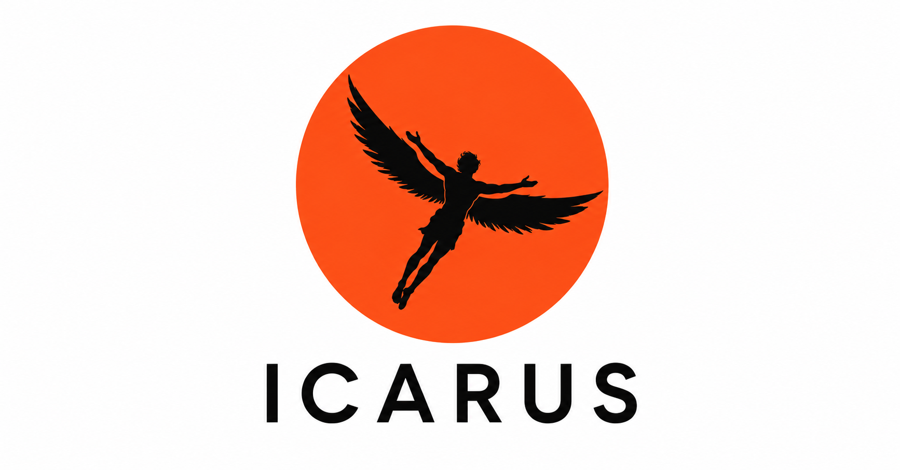
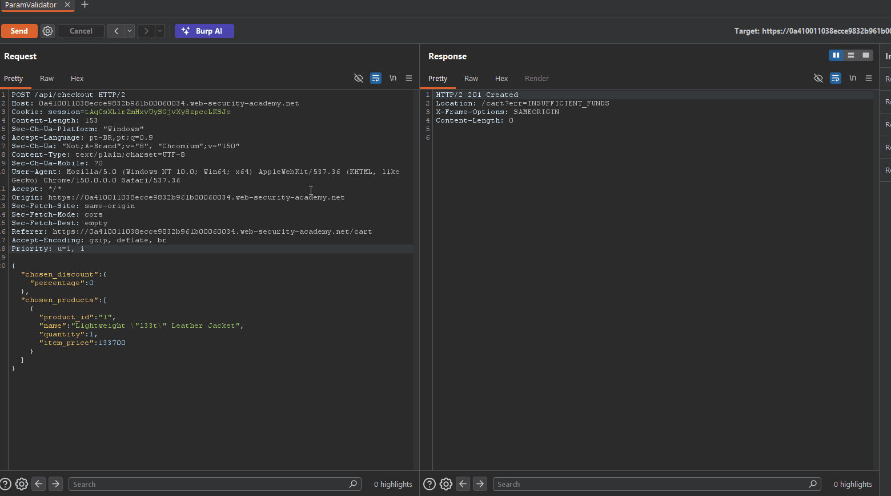
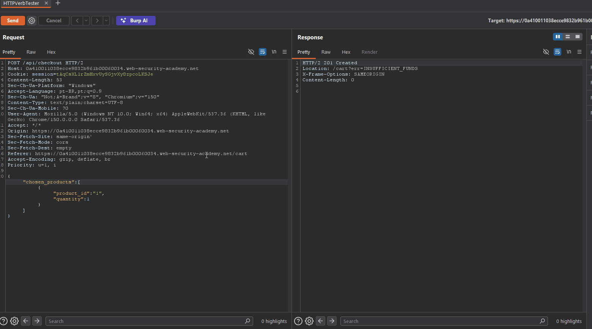

<p align="center">
  
</p>
<h1 align="center">ICARUS 1.0</h1>

<p align="center">
  <a href="https://github.com/IcarusSec/ICARUS/actions/workflows/build.yml"></a>
  <a href="https://github.com/IcarusSec/ICARUS/releases/latest"></a>
  <a href="https://github.com/IcarusSec/ICARUS/blob/main/LICENSE"></a>
</p>

<p align="center">
  <a href="https://portswigger.net/burp/extender"></a>
  <a href="https://java.com/"></a>
  <a href="https://github.com/IcarusSec/ICARUS/blob/main/LICENSE"></a>
  
</p>

---

## 🎯 Overview

**ICARUS** is a comprehensive, AI-native offensive security testing extension for Burp Suite. Designed to automate and streamline API security assessments, it brings powerful vulnerability detection, intelligent fuzzing, WAF evasion, and a master-detail evidence reporting engine directly into your Burp workflow. 

ICARUS centralizes your offensive operations, accelerating workflows from discovery to the final client report.

---

## ✨ Core Features

- **Advanced ParamValidator & WAF Evasion:** Deeply tests JSON bodies, URL parameters, and Form-Urlencoded data. Features behavioral WAF detection that actively triggers an evasion payload jump (utilizing a CRS 4-tuned payload list and advanced GLOB/NOTNULL SQLi bypasses).
- **Embedded AI Integration (MCP):** ICARUS hosts its own Model Context Protocol (MCP) server over Streamable HTTP. AI agents can directly connect to read traffic, trigger `validate_finding` attacks, and automatically capture visual evidence.
- **Master-Detail Evidence Manager:** A dedicated UI tab featuring a two-phase visual annotation workflow. Rename, drag-and-drop, and curate your findings. Includes a Retest Mode that visually stamps `FIXED` or `NOT FIXED` banners on evidence.
- **Dynamic Report Engine:** A flexible Report Profiles architecture. Build your own flow using drag-and-drop sections, write custom Master-Detail Markdown, and export to fully themed HTML or offline OpenPDF reports.
- **AutoAuth:** Replaces clunky Burp Macros. Highlight-and-click to map tokens, and ICARUS silently refreshes and injects them in the background so your sessions never expire.
- **Unified Command Interface:** A centralized control panel for configuring all modules, tracking active tasks, and managing vulnerability findings in real-time.

---

## 🧩 Extension Modules

ICARUS integrates multiple specialized security testing engines into a single cohesive extension. Click to expand each module's technical capabilities:

<details>
<summary><b>1. JSON & URL ParamValidator (with WAF Evasion)</b></summary>
<br>
Focuses on rigorous testing of JSON request parameters, URL query strings, and Form-Urlencoded data to determine if the backend API processes malformed or malicious inputs.
<br><br>

<p align="center">
  
</p>
<br>

- **WAF Evasion Engine:** Behaviorally detects WAF blocks and executes evasion payload jumps using CRS 4-tuned payloads to bypass filters like `libinjection`.
- **Smart Baseline Diffing:** Accurately detects boolean-based SQLi and subtle state transitions by diffing against non-2xx baselines.
- **Structural & Boundary Validation**: Identifies missing enforcement of null values, type confusion, and boundary limits.
</details>

<details>
<summary><b>2. HTTP Verb Tester</b></summary>
<br>
Performs exhaustive HTTP verb validation, automatically mutating requests using alternate methods (`GET`, `HEAD`, `POST`, `OPTIONS`, `TRACE`, etc.) to uncover endpoint misconfigurations.
<br><br>

<p align="center">
  
</p>
</details>

<details>
<summary><b>3. Rate Limit Tester</b></summary>
<br>
Executes high-velocity requests to accurately detect, characterize, and attempt bypasses on API rate limiting implementations. Features a heavily concurrent blast engine with smart 429/backoff throttling.
</details>

<details>
<summary><b>4. JWT / Bearer Token Checker</b></summary>
<br>
A robust engine for detecting, parsing, and exploiting JSON Web Tokens (JWTs) and Bearer tokens for critical security flaws (e.g., `alg=none`, signature stripping, missing `exp` claims).
</details>

<details>
<summary><b>5. AutoAuth Module</b></summary>
<br>
Replaces Burp's Macros with a highlight-and-click workflow for managing authentication tokens, keeping your sessions alive across multiple sources silently in the background.
</details>

<details>
<summary><b>6. Passive Error Detector</b></summary>
<br>
Runs quietly in the background, flagging HTTP 500+ responses and verbose error/stack-trace leaks (SQL errors, framework tracebacks) as they cross the proxy.
</details>

<details>
<summary><b>7. Export to Postman</b></summary>
<br>
Streamlines cross-team collaboration by exporting complex, active HTTP requests directly into a standard Postman Collection JSON format.
</details>

---

## ⚡ Quick Start (Pre-built JAR)

Don't want to compile? Grab the latest fat JAR straight from the
[**Releases page**](https://github.com/IcarusSec/ICARUS/releases/latest) —
download `icarus-<version>.jar`, then in Burp Suite go to
**Extensions → Add → extension type: Java** and select the file.

---

## 🚀 Installation & Compilation

1. **Compile the Extension**  
   Run the build script from the `icarus-extension/` directory. This script automatically downloads the required Montoya API dependency, OpenPDF, MCP SDK, and other libraries, packaging them into a single fat JAR.

   ### Linux / macOS
   ```bash
   cd icarus-extension/
   ./build.sh
   ```

   ### Windows (PowerShell)
   ```powershell
   cd icarus-extension\
   powershell -ExecutionPolicy Bypass -File build.ps1
   ```

   *Output will be located at:* `icarus-extension/build_manual/libs/icarus-<version>.jar`

2. **Load into Burp Suite**  
   - Open Burp Suite and navigate to the **Extensions** tab.
   - Click **Add**.
   - Select **Java** as the extension type.
   - Select the generated `icarus-<version>.jar` file.

---

## 📖 Documentation

For a deep dive into ICARUS's capabilities, check out our official documentation:
- **[Getting Started](docs/getting_started.md)**
- **[Testing Workflows](docs/workflows.md)**
- **[Dynamic Reporting Engine](docs/features/reporting.md)**
- **[Evidence Manager](docs/features/evidence_manager.md)**
- **[AutoAuth](docs/features/autoauth.md)**

*(See the `docs/` folder for complete technical architecture and module guides).*

---

## 🛠 Usage Guidelines

- **Configuration:** Navigate to the dedicated **ICARUS** tabs (Settings, Evidence Manager, Reporting) in the main Burp Suite interface to configure specific profiles and manage findings.
- **Execution:** Right-click any HTTP request in the **Repeater**, **Proxy history**, or **Target** scope, navigate to **Extensions → ICARUS**, and select an individual module or choose **Run All Modules** for a full assessment.

---

## ⚠️ Disclaimer

> [!WARNING]
> These tools are explicitly intended for:
> - Security research and vulnerability analysis
> - Defensive security engineering
> - Authorized penetration testing engagements
> - Secure software development lifecycles
>
> **You must only use this software against systems, networks, and applications that you are explicitly authorized to test.**

---

## ⚖️ License

ICARUS is open-sourced software licensed under the [MIT License](LICENSE).
