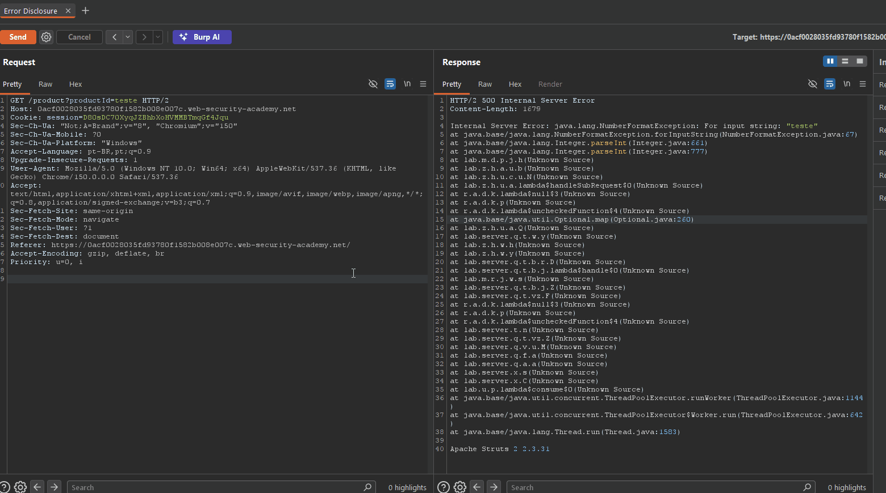

<p align="center">
  
</p>
<h1 align="center">ICARUS</h1>

<p align="center">
  <a href="https://portswigger.net/burp/extender"></a>
  <a href="https://java.com/"></a>
  <a href="https://github.com/IcarusSec/ICARUS/blob/main/LICENSE"></a>
  
</p>

---

## 📖 Table of Contents
- [Overview](#-overview)
- [Core Features](#-core-features)
- [Extension Modules](#-extension-modules)
- [Installation & Compilation](#-installation--compilation)
- [Usage Guidelines](#-usage-guidelines)
- [Changelog](CHANGELOG.md)
- [Disclaimer](#-disclaimer)
- [License](#-license)

---

## 🎯 Overview

**ICARUS** is a comprehensive, enterprise-grade security testing extension for Burp Suite. Designed to automate and streamline API security assessments, it brings powerful vulnerability detection, intelligent fuzzing, and smart evidence capture directly into your Burp workflow. By centralizing operations within a unified interface, ICARUS accelerates security workflows from discovery to reporting.

---

## ✨ Core Features

- **Unified Command Interface:** A centralized control panel (`ICARUS` tab) for configuring all modules, tracking active tasks, and managing vulnerability findings in real-time.
- **AutoAuth:** Replaces clunky Burp Macros with a highlight-and-click workflow — mark a token in a response as the source, mark where it needs to go in a request, and ICARUS silently keeps it fresh and injected in the background from then on.
- **Smart Evidence Capture:** An advanced reporting workflow that generates clean, actionable evidence. Hitting Ctrl+P or "Create Evidence" now quietly checks the response first and offers to auto-populate the title, description, and severity if it spots something (a verbose error leak, an unencoded reflection). Features full HTTP payload logging, a built-in interactive image editor (box, arrow, highlight, redact, plus copy-to-clipboard), and automated HTML report generation.
- **Passive Threat Detection:** Background monitoring that flags server errors and verbose error/stack-trace leaks as they cross the proxy, with a lightweight toast notification so you know to check the Results tab.
- **Automated Rapid Scanning:** Execute comprehensive security checks against selected HTTP requests with a single click directly from the Burp context menu.

---

## 🧩 Extension Modules

ICARUS integrates multiple specialized security testing engines into a single cohesive extension. Click to expand each module's technical capabilities:

<details>
<summary><b>1. JSON Input Validation (ParamValidator)</b></summary>
<br>
Focuses on rigorous testing of JSON request parameter validation to determine if the backend API processes malformed or malicious inputs that violate the expected schema contract.
<br>
<br>

<p align="center">
  
</p>
<br>

- **Structural Validation**: Identifies missing enforcement of null values, removed fields, and empty objects/arrays.
- **Type Confusion**: Tests for unsafe type casting (e.g., passing strings as booleans/integers).
- **Boundary Testing**: Validates enforcement of limits using empty strings, excessive lengths, and negative boundaries.
- **Injection Payloads**: Automates the discovery of SQLi, XSS, NoSQL injection, and Path Traversal vulnerabilities.
</details>

<details>
<summary><b>2. HTTP Verb Tester (HttpVerbModule)</b></summary>
<br>
Performs exhaustive HTTP verb validation for API security testing, automatically mutating standard requests using alternate methods (`GET`, `HEAD`, `POST`, `OPTIONS`, `TRACE`, etc.) to uncover endpoint misconfigurations.

- Automatically adjusts request body content based on the injected HTTP method.
- Provides deep `OPTIONS` and `Allow` header validation.
- Detects unsafe `TRACE` reflection vulnerabilities.
</details>

<details>
<summary><b>3. JWT / Bearer Token Checker (JwtCheckerModule)</b></summary>
<br>
A robust engine for detecting, parsing, and exploiting JSON Web Tokens (JWTs) and Bearer tokens for critical security flaws.

- **Automated Discovery**: Hunts for JWTs across all standard HTTP headers and cookies.
- **Algorithm Analysis**: Detects weak configurations (e.g., `alg=none` bypasses) and flags unsafe embedded claims (`jwk`, `jku`, `kid`).
- **Payload Tampering**: Attempts automatic privilege escalation by manipulating common claims (`admin`, `role`, `scope`).
- **Signature Attacks**: Tests endpoint resilience against improper signature validation and signature stripping.
- **Time-based Attacks**: Detects missing `exp`/`iat` claims to prevent token expiration bypasses.
</details>

<details>
<summary><b>4. Rate Limit Tester (RateLimitModule)</b></summary>
<br>
Executes high-velocity requests to accurately detect, characterize, and attempt bypasses on API rate limiting implementations.

- **Burst Detection**: Determines active throttling behaviors and block thresholds.
- **Highly Configurable**: Granular control over request counts, concurrency, and timing delays.
- **Advanced Evidence**: Captures precise Requests Per Second (RPS) metrics and timestamps for accurate reporting.
</details>

<details>
<summary><b>5. Sensitive Header Scanner (SensitiveHeaderModule)</b></summary>
<br>
Passively and actively inspects HTTP responses for sensitive header disclosures or caching misconfigurations that could lead to critical data leakage.
</details>

<details>
<summary><b>6. Export to Postman (PostmanExportModule)</b></summary>
<br>
Streamlines cross-team collaboration by exporting complex, active HTTP requests directly into a standard Postman Collection JSON format.

- Accurately extracts the HTTP method, headers, and intricate URL structures.
- Secures complex body payloads with proper JSON escaping.
</details>

<details>
<summary><b>7. AutoAuth (AutoAuthModule)</b></summary>
<br>
Replaces Burp's Macros with a highlight-and-click workflow for managing authentication tokens, so expired sessions never interrupt a testing flow again.

- **Highlight & Click Setup**: Right-click a token value in a response → "Set as Auth Token Source". Right-click a header or JSON field in a request → "Add Auth Token Destination".
- **Silent Background Refresh**: Detects an expired cached token, quietly re-fetches it from the source request, and injects it into every matching outgoing request.
- **Host-Scoped Injection**: A token captured from one site can never leak into another site's requests.
- **Persistent**: Your source/destination mapping survives extension reloads and Burp restarts.
</details>

<details>
<summary><b>8. Passive Error Detector (PassiveErrorModule)</b></summary>
<br>
Runs quietly in the background, flagging HTTP 500+ responses and verbose error/stack-trace leaks (SQL errors, framework tracebacks, etc.) as they cross the proxy — no manual scan required.
</details>

<details>
<summary><b>9. Create Evidence (CreateEvidenceModule)</b></summary>
<br>
Transforms raw HTTP traffic into professional vulnerability evidence with minimal manual effort.
<br>
<br>

<p align="center">
  
</p>
<br>
Features include:

- **Automatic detection** of verbose error disclosures and unencoded reflections.
- **Automatic pre-population** of title, description, and severity.
- **Complete** HTTP request/response logging.
- **Built-in** image editor (boxes, arrows, highlights, redaction).
</details>

---

## 🚀 Installation & Compilation

1. **Compile the Extension**  
   Run the build script from the `icarus-extension/` directory. This script automatically downloads the required Montoya API dependency, compiles the Java source, and packages the JAR.
   ```bash
   cd icarus-extension/
   ./build.sh
   ```
   *Output will be located at:* `icarus-extension/build_manual/libs/icarus-<version>.jar`

2. **Load into Burp Suite**  
   - Open Burp Suite and navigate to the **Extensions** tab.
   - Click **Add**.
   - Select **Java** as the extension type.
   - Select the generated `icarus-<version>.jar` file.

---

## 🛠 Usage Guidelines

- **Configuration:** Navigate to the dedicated **ICARUS** tab in the main Burp Suite interface to configure specific module settings, manage your active tasks, and review detailed findings.
- **Execution:** Right-click any HTTP request in the **Repeater**, **Proxy history**, or **Target** scope, navigate to **Extensions → ICARUS**, and select an individual module or choose **Run All Modules** for a full assessment.

---

## ⚠️ Disclaimer

> [!WARNING]
> These tools are explicitly intended for:
> - Security research and vulnerability analysis
> - Defensive security engineering
> - Authorized penetration testing engagements
> - Secure software development lifecycles
>
> **You must only use this software against systems, networks, and applications that you are explicitly authorized to test.**

---

## ⚖️ License

ICARUS is open-sourced software licensed under the [MIT License](LICENSE).
