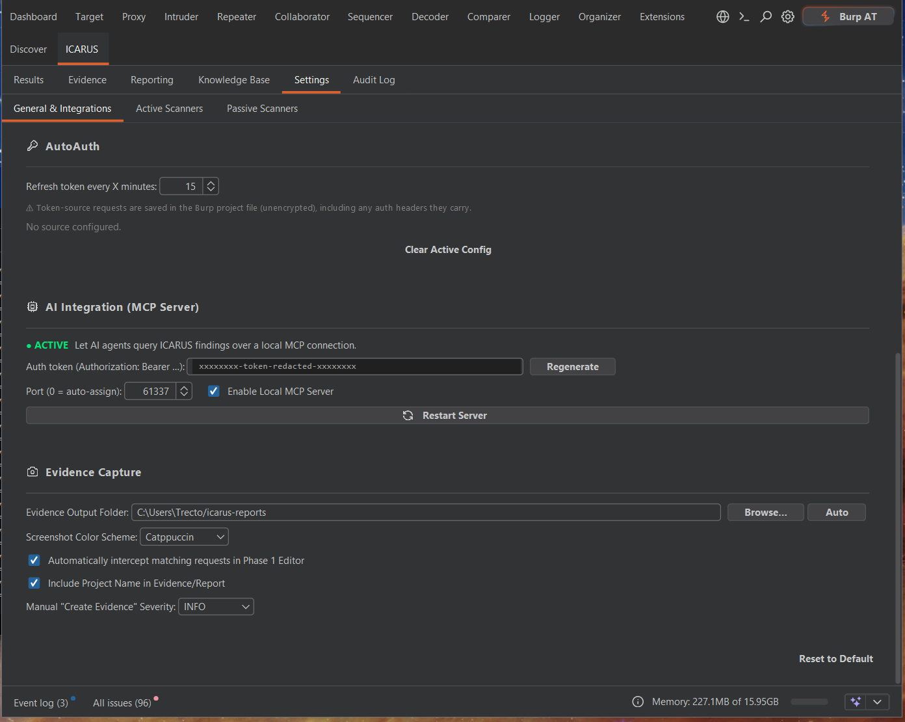

# AutoAuth Engine

Managing expiring session tokens and complex authentication sequences is notoriously tedious in Burp Suite using traditional Macros. ICARUS replaces this with **AutoAuth**, a seamless, background workflow.

## How it Works

AutoAuth operates on a simple Source-Destination mapping model.

1. **Define the Source (Where the token comes from)**
   - Highlight the token value (e.g., `"access_token": "eyJhb..."`) in an HTTP response within Burp.
   - Right-click and select **Extensions > ICARUS > AutoAuth: Set as Auth Token Source**.
   - ICARUS registers the request that generated this token.

2. **Define the Destination (Where the token goes)**
   - Highlight the location in an HTTP request where the token should be injected (e.g., `Authorization: Bearer [highlight here]`).
   - Right-click and select **Extensions > ICARUS > AutoAuth: Add Auth Token Destination**.

The refresh cadence and a warning about where token-source requests are stored live under
**Settings → General & Integrations → AutoAuth**.

  

## Silent Background Refresh

Once mapped, AutoAuth silently monitors your outgoing traffic for that specific host. 
- If a request is about to be sent (from Repeater or a Scanner) and the cached token is missing or expired, AutoAuth pauses the request.
- It quietly replays the **Source** request in the background, extracts the fresh token, updates its cache, and injects it into the pending **Destination** request.
- The request then proceeds normally.

## Security Constraints

- **Host-Scoped:** AutoAuth enforces strict host matching. A token captured from `api.example.com` will *never* be inadvertently injected into a request bound for `api.malicious.com`, preventing accidental token leakage.
- **Persistent Storage:** Your mappings survive Burp restarts, allowing you to resume testing a complex application days later without re-configuring authentication macros. Note that token-source requests are saved in the Burp project file unencrypted, including any auth headers they carry.
