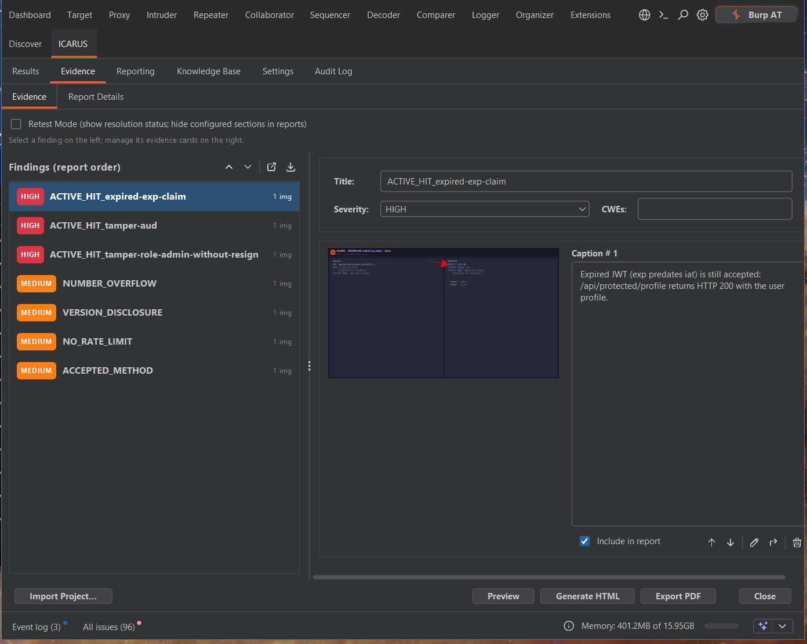
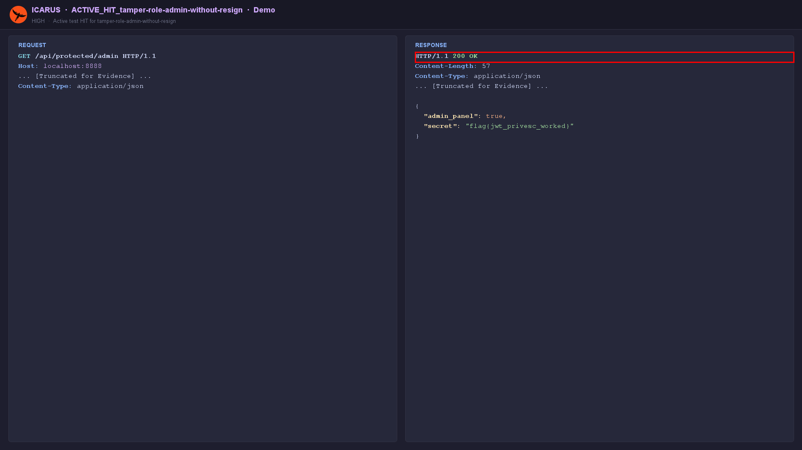
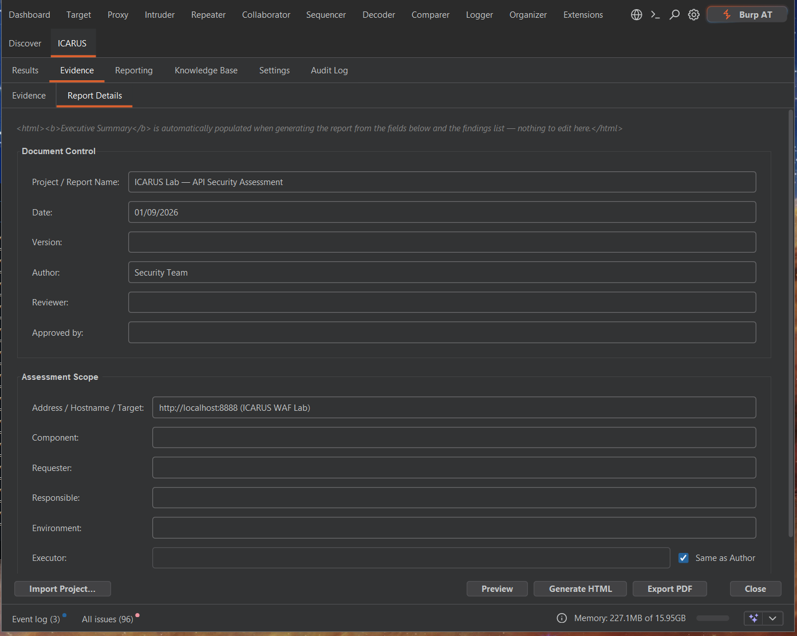
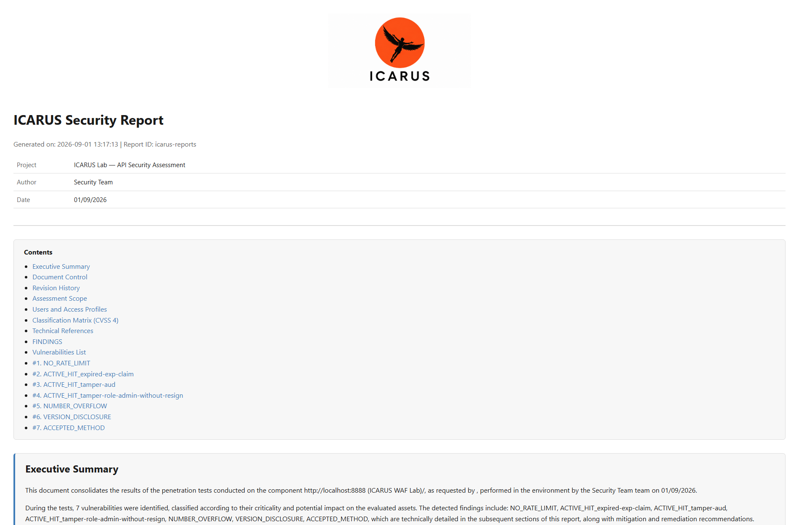

# Evidence Manager & Reporting

A massive portion of security testing is documentation. ICARUS's Evidence Manager is designed to turn raw HTTP traffic into a client-ready deliverable with near-zero friction.

## Capturing Evidence

You can capture evidence from anywhere in Burp (Proxy, Logger, Repeater).

1. Right-click the request/response you want to capture.
2. Select **Extensions > ICARUS > Send to Reporter Creation** (or hit `Ctrl+P`).
3. **One-Click Apply:** In the popup, click "Apply". ICARUS automatically renders a screenshot of the HTTP exchange, calculates severity based on common signatures, and saves it into the active report state. No file-save dialogs are necessary.

## The Evidence Manager Interface

Navigate to the **ICARUS Tab > Evidence** to curate your captured findings. Pick a finding
on the left; its title, severity, CWEs, and evidence cards (with per-card captions and an
*Include in report* toggle) are on the right.

  

- **Drag-and-Drop Reordering:** Drag findings — and evidence cards within a finding — to set the order they appear in the report.
- **Offline CWE Tagging:** Type into the CWEs field (e.g. "SQL" or "Cross Site"); a typeahead search queries the bundled, offline CWE dataset.
- **Toggling Visibility:** Un-check *Include in report* to drop a card from the *next* export without deleting its underlying image.
- **Annotations:** Open the annotation editor on a card to add boxes, highlights, redactions, or arrows directly onto the HTTP payload screenshot.

  

The **Report Details** sub-tab holds the Document Control and Assessment Scope fields
(project name, dates, author, target, environment) that populate the report header.

  

## Exporting Reports

ICARUS generates self-contained reports entirely offline (see the
[Dynamic Report Engine](reporting.md) for structure, themes, and profiles).
1. Click **Preview HTML** to render the report in an embedded browser inside Burp, or **Preview PDF**.
2. **Generate HTML** writes a single-file HTML report with embedded Base64 images; **Export PDF** renders a paginated PDF via OpenPDF with a table of contents and page-break-safe finding cards.

  

