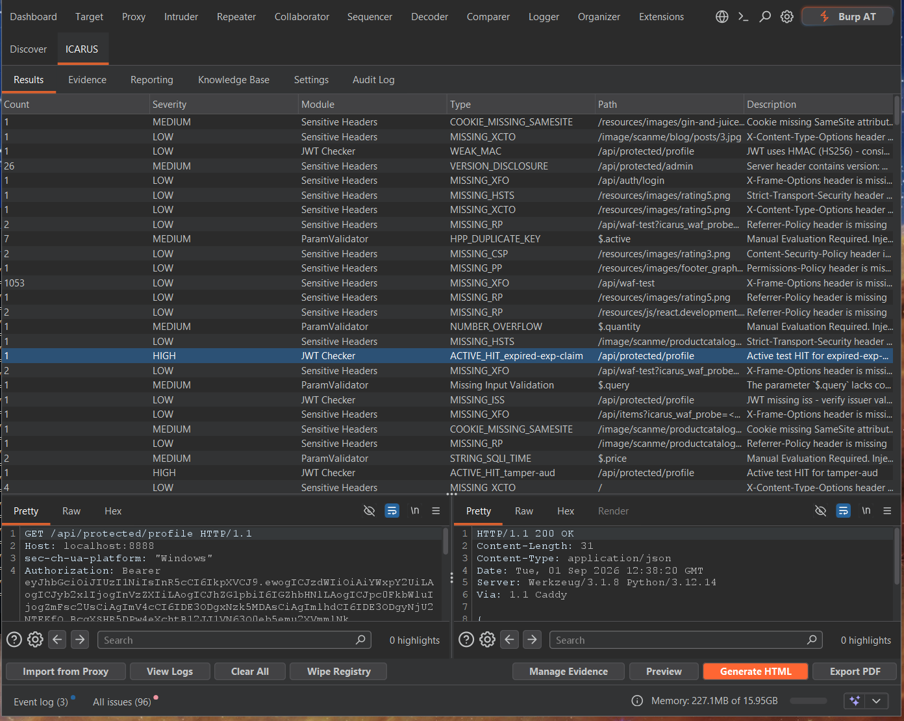
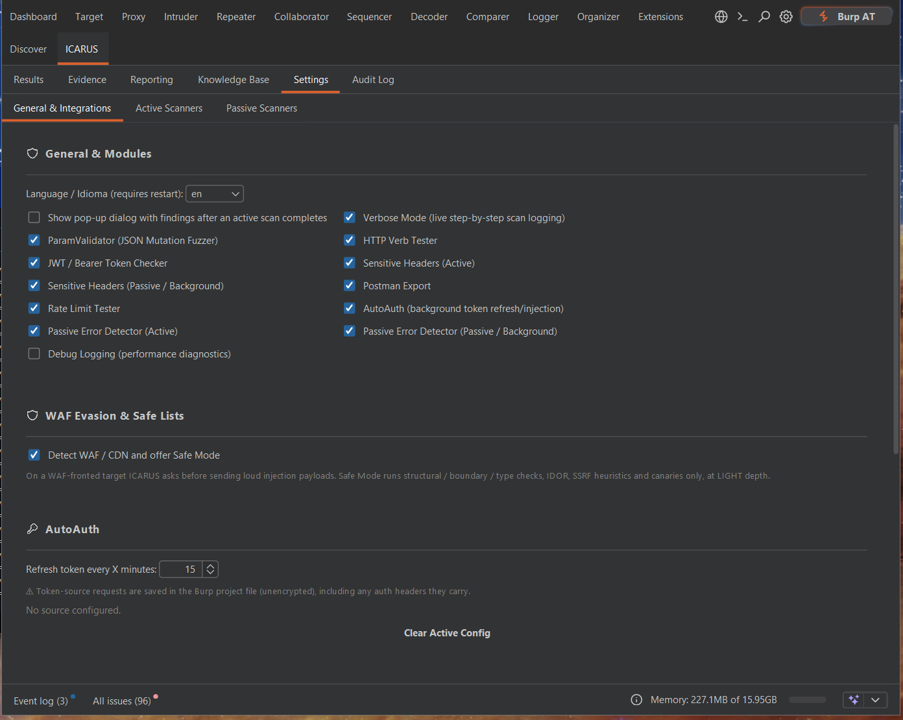

# Getting Started with ICARUS

This guide will walk you through compiling the ICARUS codebase and installing it within Burp Suite.

## Prerequisites
- A **JDK** on your `PATH` (the build targets `--release 19`; a newer JDK is fine).
- **Burp Suite Professional or Community Edition** (Java 17+ runtime).

## 1. Compile the Extension

The build is a self-contained script — no Gradle or Maven. It downloads the Montoya API,
OpenPDF, the MCP SDK, and commonmark-java, compiles the sources with `javac`, and packages
everything into one fat JAR.

### Linux / macOS
```bash
cd icarus-extension/
./build.sh
```

### Windows (PowerShell)
```powershell
cd icarus-extension\
powershell -ExecutionPolicy Bypass -File build.ps1
```

*The generated `.jar` will be saved to:* `icarus-extension/build_manual/libs/icarus-<version>.jar`

> Prefer not to compile? Grab the pre-built fat JAR from the
> [Releases page](https://github.com/IcarusSec/ICARUS/releases/latest).

## 2. Load into Burp Suite

1. Open Burp Suite.
2. Navigate to the **Extensions** tab.
3. Click the **Add** button in the "Installed" section.
4. Set the extension type to **Java**.
5. Select the `icarus-<version>.jar` file generated in the previous step.
6. Verify that ICARUS loads without errors. The **ICARUS** tab will appear in the main navigation bar.

<p align="center">
  
</p>

## 3. Initial Configuration

Before running scans, open the **ICARUS → Settings** tab. It has three sub-tabs:

- **General & Integrations** — enable/disable modules, WAF-evasion Safe Mode, the AutoAuth
  refresh interval, the embedded MCP server, and evidence-capture defaults.
- **Active Scanners** — per-module tuning: ParamValidator scan depth and mutation
  categories, HTTP Verb method list, Rate Limit burst size / concurrency / bypass attempts.
- **Passive Scanners** — Sensitive Header detection categories and claim/PII redaction.

<p align="center">
  
</p>
