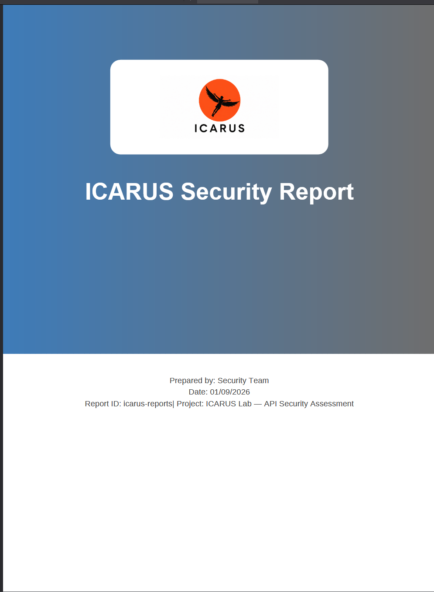
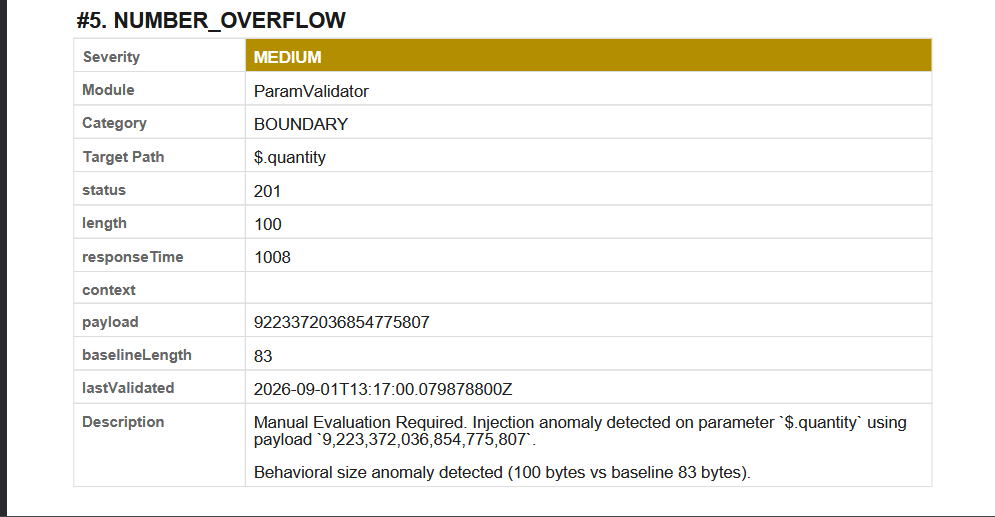

# 📢 ICARUS 1.0: The Complete Offensive Pipeline (Official Launch)

What started as a handful of Bambda scripts has grown into something far more powerful. We are thrilled to announce the official release of **ICARUS 1.0** — a complete, AI-native offensive security pipeline and Burp Suite Montoya extension.

ICARUS 1.0 completely reimagines how you test, capture evidence, and report vulnerabilities. Here is what makes this launch so special:

  

## ⚡ The ParamValidator & Advanced WAF Evasion
At the heart of ICARUS is our deeply evolved **ParamValidator**. It aggressively tests JSON bodies, URL parameters, and Form-Urlencoded data for vulnerabilities like SQLi, XSS, SSRF, IDOR, CMDi, and SSTI.
*   **Behavioral WAF Detection & Evasion:** If ICARUS hits a WAF mid-scan, it doesn't give up. It automatically fingerprints the WAF and executes an "evasion payload jump", actively pulling from a CRS 4-tuned payload list to bypass defenses (including advanced GLOB/NOTNULL SQLi bypasses against `libinjection`).
*   **Smart Baseline Diffing:** Accurately detects boolean-based SQLi and subtle state transitions by diffing against non-2xx baselines.

## 🤖 Native AI Agent Integration (MCP)
ICARUS 1.0 is built for the future of AI-assisted pentesting. It hosts its own embedded **Model Context Protocol (MCP)** server natively inside Burp.
*   **Agent Tooling:** AI agents can directly connect to ICARUS to read traffic, trigger `validate_finding` or `exploit_finding` attacks, and automatically capture evidence.
*   **Zero-Touch Evidence:** AI agents can render perfect, whitespace-trimmed evidence images with visual annotations without ever taking a manual screenshot.

## 🗂️ Master-Detail Evidence Manager
Say goodbye to disorganized screenshots. ICARUS 1.0 introduces a dedicated, high-performance Evidence Manager tab.
*   **Visual Annotation Workflow:** Capture evidence in two phases: Smart Text Cleanup (removing clutter) followed by a fully-featured visual canvas (boxes, arrows, highlights, and redactions).
*   **Total Control:** Rename findings, double-click and drag-and-drop to reorder, paste screenshots directly from your clipboard, and toggle a "Retest" mode that automatically stamps a green/red Fixed/Not Fixed banner on the image.

  

## 📄 Dynamic Report Engine
Reporting is no longer an afterthought. The new `ReportProfiles` architecture lets you build, save, and swap dynamic report configurations instantly.
*   **Master-Detail Markdown:** Write custom markdown sections, reorder built-in sections (like the Findings table) via drag-and-drop, and generate beautiful, themed HTML and PDF (OpenPDF) reports.
*   **Modern Themes:** Out of the box support for Catppuccin, Dracula, Nord, Gruvbox, and Burp Proxy Night, complete with custom logo file pickers and auto-cloning.

  
  

## ⚙️ Core Offensive Modules
Beyond the ParamValidator, ICARUS 1.0 packs a suite of specialized modules:
*   **Rate Limit Tester:** A heavily concurrent blast engine with real-time UI logging and smart 429/backoff throttling.
*   **AutoAuth & JWT Checker:** Background token refreshing, active multi-source JWT manipulation, and sensitive-claim redaction, ensuring your scans never drop auth.
*   **Passive Error Detector:** Silently hunts for verbose errors, SQLite leaks, and sensitive data exposure while you proxy traffic.

---
*ICARUS 1.0 is the culmination of hundreds of commits, UI overhauls, and pentester-driven feedback. We can't wait for you to try it.*
