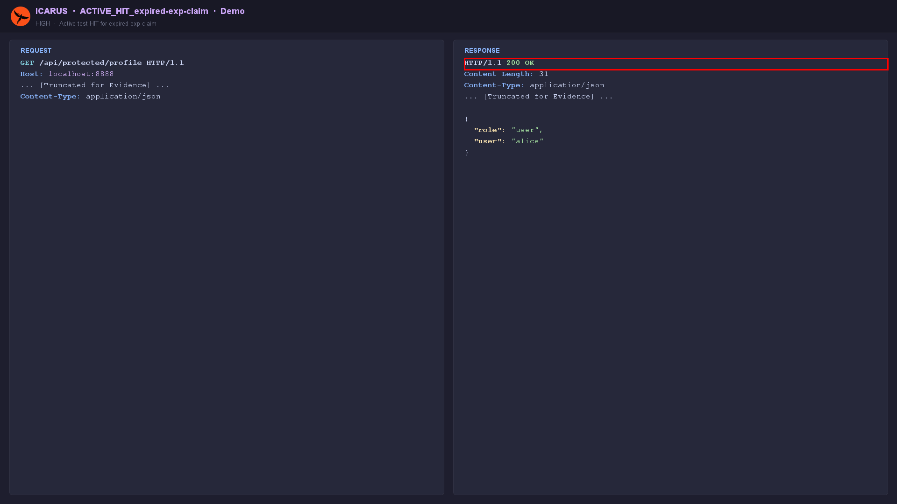
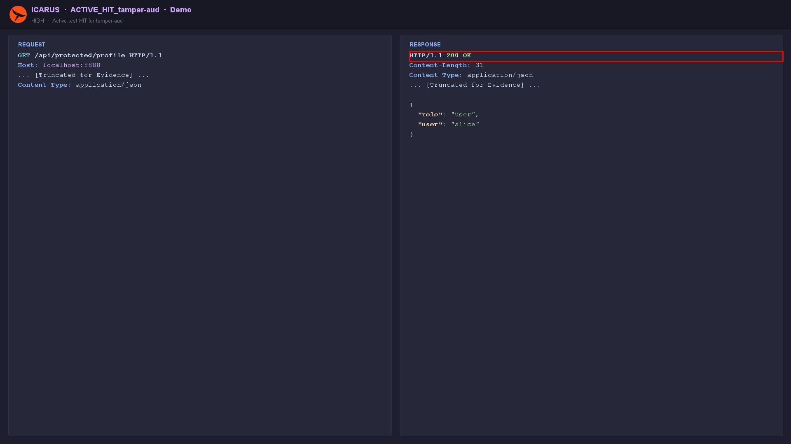

# JWT & Bearer Token Checker Module

The `JwtCheckerModule` is a robust engine dedicated to uncovering cryptographic and logical flaws in how JSON Web Tokens (JWTs) are issued and validated by the target API.

## Automated Discovery
You do not need to specify where the token is. ICARUS automatically parses all HTTP headers (like `Authorization: Bearer ...`) and cookies in the targeted request, identifies valid JWT structures, and begins attacking them.

## Attack Vectors

### Algorithm Manipulation (alg=none)
The module strips signatures and alters the JWT header to `{"alg":"none"}` to test if the backend accepts unsigned tokens.

### Signature Stripping
Tests if the endpoint verifies the signature at all by sending a valid JWT with the signature portion simply removed (leaving the trailing dot).

### Embedded Claim Abuse
Flags risky header claims like `jku` (JWK Set URL), `jwk` (JSON Web Key), and `kid` (Key ID), which are often leveraged for cryptographic bypasses (e.g., pointing `kid` to an attacker-controlled file).

### Privilege Escalation Tampering
Parses the payload claims and aggressively mutates them:
- Alters roles (e.g., changing `"role":"user"` to `"role":"admin"`).
- Alters boolean flags (e.g., `"isAdmin": false` to `true`).
- Re-signs the tampered token if a weak secret is known, or sends it unsigned to test for validation failures.

### Time-based Bypass
Detects the absence of `exp` (Expiration Time) or `iat` (Issued At) claims, reporting tokens that essentially live forever, and re-sends already-expired tokens to check whether `exp` is actually enforced.

## Example Findings

**Privilege escalation** — payload `role` changed to `admin` *without re-signing*;
`/api/protected/admin` returns `HTTP 200` and the admin secret:

  

**Expired token accepted** — a JWT whose `exp` predates its `iat` still returns the profile:

  

**`aud` tampering** — an injected `aud` claim with an unchanged signature is still accepted:

  

> The **Settings → Passive Scanners → JWT / Bearer Token Checker** option redacts sensitive
> claim values in findings, logs, and reports (showing the claim key only).
