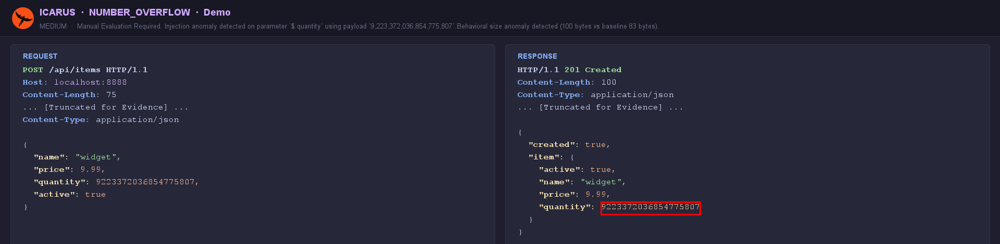

# JSON Parameter Validator Module

The `ParamValidatorModule` is designed to rigorously test JSON request payloads against the backend API's expected schema and validation logic. It aggressively fuzzes JSON structures to uncover parsing bugs, logic bypasses, and injection vulnerabilities.

Scan depth (*Light* ≈ 20 mutations/param, *Medium* ≈ 60, *Deep* ≈ 200 + per-technique
WAF-evasion variants), the mutation categories, and each injection technique (SQLi,
time-based SQLi, XSS, NoSQLi, path traversal, format string, Unicode/RTL, CMDi, SSTI, SSRF,
IDOR) are toggled under **Settings → Active Scanners → ParamValidator**.

  

## Core Capabilities

### Structural Fuzzing
- **Missing Enforcement:** Systematically removes required fields from the JSON payload.
- **Empty Structures:** Replaces valid objects with `{}` and valid arrays with `[]`.
- **Null Value Injection:** Replaces valid strings and integers with explicit `null` values to trigger NullPointerExceptions on the backend.

### Type Confusion
Tests how the backend handles unexpected data types being bound to strict model fields.
- Casts strings to integers (e.g., `"age": "25"` -> `"age": 25`).
- Casts booleans to strings (e.g., `"isAdmin": true` -> `"isAdmin": "true"` or `"1"`).

### Boundary Testing
- Injects extremely large integers, negative integers, and empty strings into string fields to test database constraints and integer overflow vulnerabilities.

### Deep Injection
Automates the discovery of classical web vulnerabilities nested deep within JSON trees:
- SQL Injection payloads (e.g., `' OR 1=1--`).
- NoSQL Injection primitives (e.g., `{"$gt": ""}`).
- Cross-Site Scripting (XSS) vectors.
- Path Traversal signatures (`../../../etc/passwd`).

*This module works highly recursively, testing nested JSON objects and arrays thoroughly.*

## Example Finding

`NUMBER_OVERFLOW` — `$.quantity = 9223372036854775807` (int64 max) is accepted and
persisted verbatim (`HTTP 201`), with no numeric-bounds validation:

  

