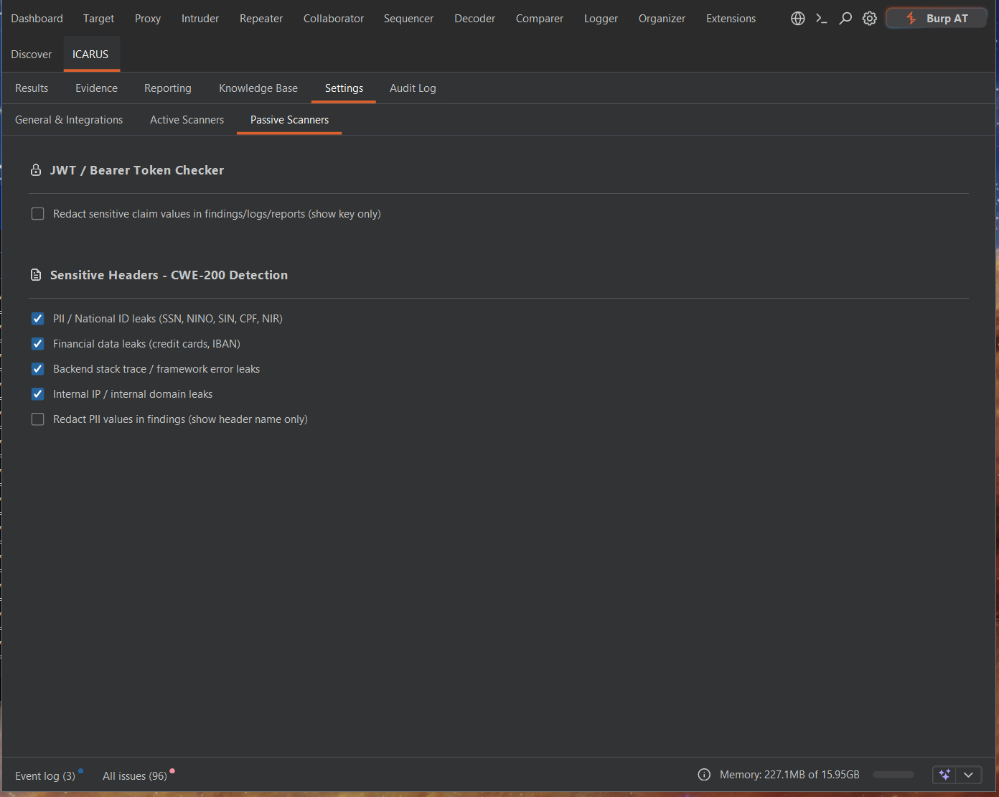
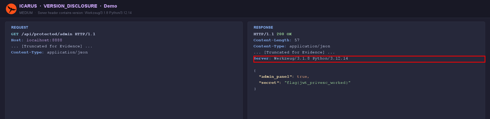

# Passive Scanners

Unlike Active Modules (which generate substantial HTTP traffic), the Passive Scanners operate entirely in the background. They hook into Burp Suite's proxy stream and quietly monitor all traffic passing through.

## Sensitive Header Module (`SensitiveHeaderModule`)
Analyzes all HTTP responses (CWE-200) for the disclosure of sensitive infrastructure information, PII, or caching misconfigurations.

- **Infrastructure Disclosure:** Flags headers like `Server`, `X-Powered-By`, and `X-AspNet-Version` that leak specific technology stacks and versions.
- **PII / National ID leaks:** SSN, NINO, SIN, CPF, NIR.
- **Financial data leaks:** credit card numbers, IBANs.
- **Internal IP / internal domain leaks** and backend stack-trace / framework-error leaks.
- **Caching / security-header gaps:** missing or weak `Cache-Control`, HSTS, CSP, `X-Frame-Options`, etc.

Each category, plus a "show header name only" redaction toggle, is under
**Settings → Passive Scanners**.

  

### Example Finding

`VERSION_DISCLOSURE` — the `Server` banner discloses exact software versions
(`Werkzeug/3.1.8 Python/3.12.14`):

  

## Passive Error Detector (`PassiveErrorModule`)
A crucial module for quickly identifying backend crashes during manual testing without requiring an active scan.

- **HTTP 5xx Monitoring:** Immediately flags any `500 Internal Server Error`, `502 Bad Gateway`, or `504 Gateway Timeout`.
- **Verbose Stack Trace Detection:** Employs regex signatures to scan response bodies for deep framework tracebacks. It detects:
  - Raw SQL queries leaking (e.g., MySQL syntax errors).
  - Java/Spring stack traces.
  - Python/Django debug pages.
  - PHP warnings and fatal errors.

When a passive scanner flags an issue, a lightweight **Toast Notification** appears, allowing you to review the finding in the ICARUS Results tab at your convenience.
