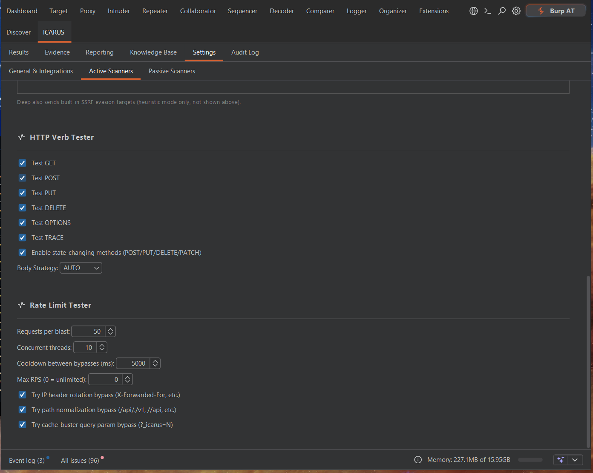
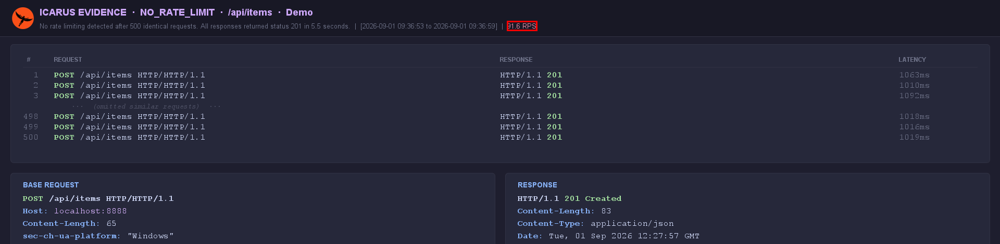

# Rate Limit Tester Module

The `RateLimitModule` executes high-velocity request bursts to accurately detect, characterize, and attempt bypasses on API rate limiting implementations.

## Execution Phases

### Phase 1: Burst Detection
ICARUS strips mutable payloads from the request and fires `N` identical requests in highly
concurrent threads. *Requests per blast*, *concurrent threads*, *cooldown between bypasses*,
and an optional *max RPS* cap are set under **Settings → Active Scanners → Rate Limit Tester**.
- It monitors the HTTP status codes returned (e.g., `429 Too Many Requests`) and the achieved requests-per-second.
- If no limits are hit, it reports `NO_RATE_LIMIT`. If limits are hit, it proceeds to Phase 2.

  

### Phase 2: Characterization
Once a block occurs, the module analyzes the response to determine the enforcement mechanism.
- Was the threshold 10 requests? 50 requests?
- Does the server rely on standard headers (`X-RateLimit-Remaining`)?
- It calculates the precise Requests Per Second (RPS) achieved during the burst.

### Phase 3: Bypass Attempts
If rate limiting is confirmed, ICARUS re-runs the burst with common bypass techniques (each toggleable in settings):
- **IP header rotation** — `X-Forwarded-For`, `X-Real-IP`, `Client-IP`, etc.
- **Path normalization** — `/api/./v1`, `//api`, and similar.
- **Cache-buster query param** — `?_icarus=N`.

If the server accepts the requests with a bypass applied while the base IP remains blocked, a bypass vulnerability is flagged.

## Example Finding

`NO_RATE_LIMIT` — 500 rapid `POST /api/items` requests all succeeded (`HTTP 201`) at
91.6 RPS with no throttling or blocking:

  

