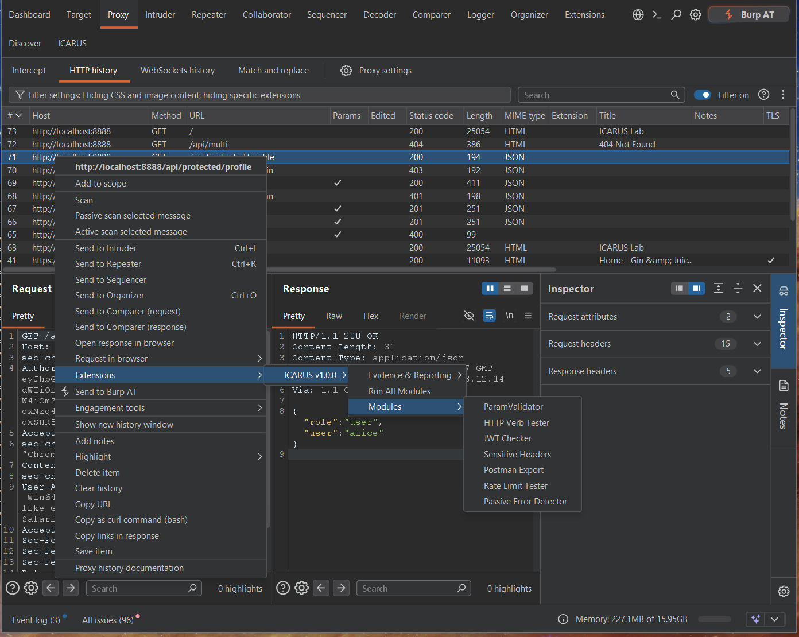
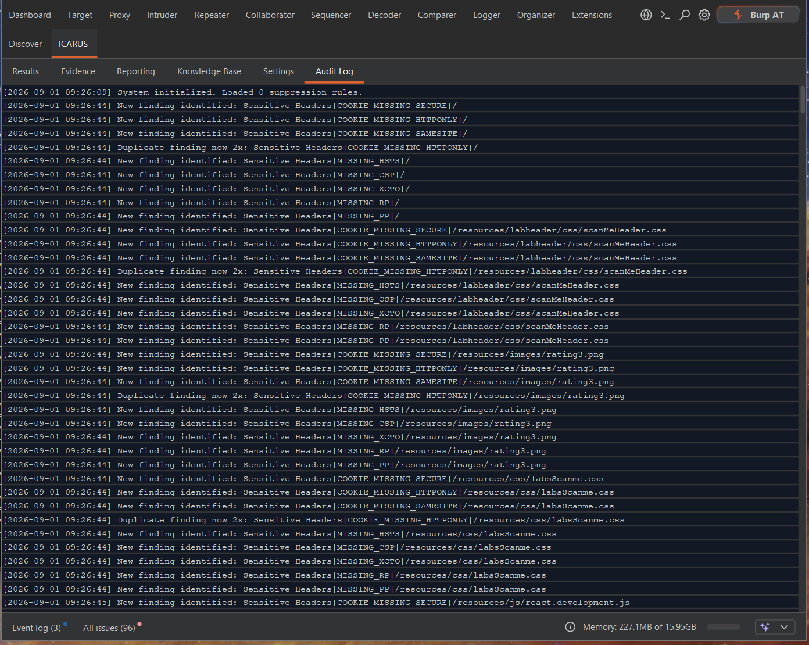
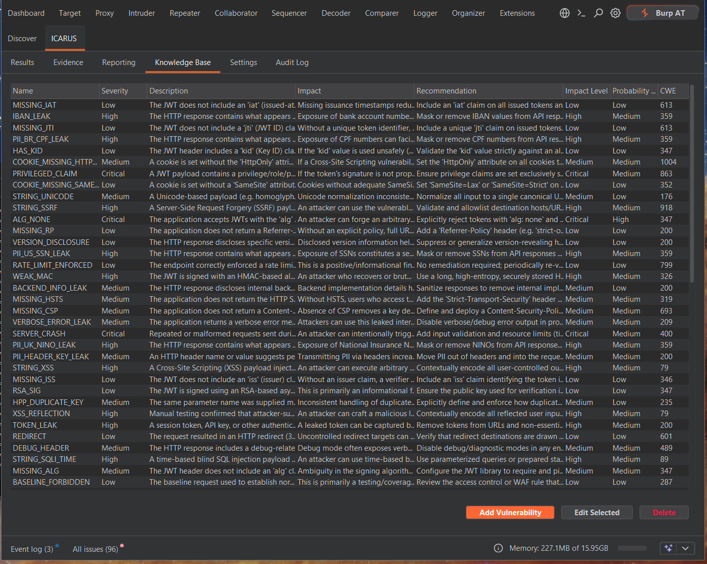

# Core Testing Workflows

ICARUS integrates natively with Burp Suite's existing UI, making it incredibly intuitive to incorporate into your day-to-day testing workflows.

## Context Menu Integration

ICARUS capabilities are accessible from virtually anywhere in Burp Suite (Repeater, Proxy history, Target map).

1. **Right-Click** any HTTP request/response.
2. Navigate to the **Extensions > ICARUS** sub-menu.
3. You will see context-aware options:
   - **Run All Modules**: Dispatches the request to all active scanning engines concurrently.
   - **Modules > [Module Name]**: E.g., `JWT Checker`. Launches a specific test in isolation.
   - **Evidence & Reporting**: Captures the request/response pair into the Evidence Manager.
   - **AutoAuth**: Set a highlighted value as an auth-token source or destination (see the AutoAuth docs).

  

## Managing Active Scans

Modules are highly concurrent and stateless, so you can launch dozens of scans at once
without freezing the UI. Two places track what's happening:

- The **Results** tab fills in with findings as modules complete.
- The **Audit Log** tab streams a timestamped line for every scan action, new finding, and
  duplicate hit — useful when you want to see exactly what a scan touched.

  

## Reviewing Findings

If a module discovers a vulnerability:
1. A **Toast Notification** (bottom right of the UI) will briefly appear to alert you.
2. The finding is logged in the **Results** tab within ICARUS, grouped by count / severity / module / type.
3. Selecting a finding shows the request/response pair that triggered it, alongside its
   description and remediation advice.

  

Descriptions, impact, recommendations, CWE, and CVSS-4 probability for each finding type
come from the bundled, fully offline **Knowledge Base** tab, which you can edit or extend
with your own vulnerability entries.

  

